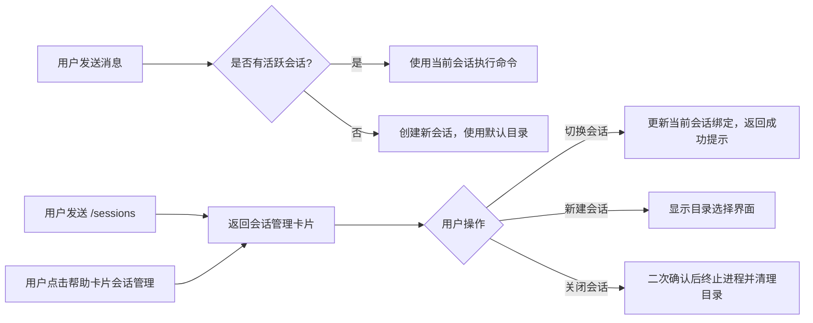

# 飞书渠道工作目录与会话管理功能设计方案

## 版本信息
- 版本：1.0
- 日期：2026-03-07
- 作者：Claude Code
- 状态：待评审

## 需求概述
为飞书渠道增加工作目录切换和多会话管理功能，与网页版行为保持一致，支持用户通过卡片交互管理多个并行工作会话。

## 功能设计

### 1. 核心行为
- **会话绑定**：每个飞书聊天支持多个并行会话，每个会话独立工作目录、独立CLI进程、独立聊天历史
- **默认流程**：用户首次发送消息自动创建新会话，使用系统默认工作目录
- **网页版兼容**：优先使用网页版设置的全局工作目录
- **状态显示**：每条回复卡片底部显示当前会话ID和工作目录路径

### 2. 入口方式
- **命令触发**：发送 `/sessions` 命令打开会话管理卡片
- **帮助卡片集成**：在 `/feishuhelp` 命令返回的帮助卡片中添加会话管理入口
- **卡片交互**：所有操作通过飞书交互式卡片完成，无需手动输入命令

### 3. 会话管理卡片功能
- 当前会话信息展示（会话ID、工作目录、运行状态）
- 会话列表展示（最近10个会话，包含工作目录、创建时间、运行状态）
- 操作按钮：
  - 🔄 切换：切换到指定会话，后续消息在该会话下执行
  - ➕ 新建：创建新会话，支持选择工作目录
  - 🗑️ 关闭：终止会话进程，清理会话目录
  - 🧹 清理：一键关闭所有空闲会话

### 4. 工作目录选择
- 预设选项：
  - 默认工作目录（与网页版一致）
  - 最近使用的5个工作目录
- 手动输入：支持输入绝对路径（仅允许白名单内目录）
- 安全校验：防止路径穿越，仅允许访问配置的工作区根目录下的路径

### 5. 清理策略（与网页版完全一致）
- **会话目录清理**：关闭会话时删除系统自动创建的会话目录（格式：`{WorkspaceRoot}/{SessionId}`）
- **用户目录保护**：不会清理用户手动指定的外部代码目录
- **进程清理**：终止会话关联的所有CLI进程
- **上下文清理**：删除内存中的会话上下文（聊天历史、线程ID等）

## 交互流程



## 技术实现方案

### 1. 数据结构扩展（FeishuChannelService）
```csharp
// 替换原来的单会话映射
private readonly Dictionary<string, List<string>> _chatSessionList = new(); // 聊天ID → 会话ID列表
private readonly Dictionary<string, string> _chatCurrentSession = new(); // 聊天ID → 当前活跃会话ID
private readonly Dictionary<string, DateTime> _sessionLastActiveTime = new(); // 会话ID → 最后活跃时间
```

### 2. 新增命令处理
- 在 `OnMessageReceivedAsync` 方法中添加 `/sessions` 命令拦截
- 扩展 `/feishuhelp` 卡片，添加会话管理功能说明和入口按钮

### 3. 卡片动作处理
- 扩展 `FeishuMessageHandler` 支持卡片按钮点击事件处理
- 新增三种动作类型：
  - `switch_session`：切换当前活跃会话
  - `create_session`：创建新会话
  - `close_session`：关闭指定会话

### 4. 安全性设计
- 目录白名单校验：仅允许访问配置的工作区根目录下的路径
- 会话权限控制：用户只能访问自己聊天下的会话
- 路径穿越防护：所有用户输入的路径都经过标准化处理和校验
- 清理安全校验：仅删除符合 `{WorkspaceRoot}/{SessionId}` 格式的目录

### 5. 涉及修改文件
| 文件路径 | 说明 |
|---------|------|
| `WebCodeCli.Domain/Domain/Service/Channels/FeishuChannelService.cs` | 主服务逻辑扩展 |
| `WebCodeCli.Domain/Domain/Service/Channels/FeishuMessageHandler.cs` | 卡片动作处理扩展 |
| `WebCodeCli.Domain/Domain/Service/Channels/FeishuCommandService.cs` | 命令处理逻辑扩展 |
| `WebCodeCli.Domain/Domain/Model/Channels/FeishuCardAction.cs` | 新增动作类型定义 |

## 兼容性说明
- 完全向后兼容现有飞书功能
- 现有会话不受影响，自动迁移到新的多会话结构
- 与网页版会话机制完全一致，共享底层服务能力

## 后续优化方向
- 支持会话重命名功能
- 支持会话持久化，服务重启后恢复
- 支持会话导入导出
- 支持工作目录收藏功能
